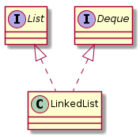
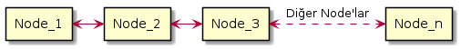

# LinkedList

`List` veri yapısının `Doubly Linked List` ve `Deque` implementasyonudur. `java.util.LinkedList` altında tanımı aşağıdaki 
gibidir.

```java
public class LinkedList<E>
    extends AbstractSequentialList<E>
    implements List<E>, Deque<E>, Cloneable, java.io.Serializable
```

Aşağıdaki görselde de görüldüğü gibi `LinkedList` hem `List` interface'ini hem de `Deque` inteface'ini implement eder.

 <div align="center">

</div>

`LinkedList'in` class/sınıf hiyerarşisine bir göz atmış olduk. Şimdi de ne gibi özellikleri olduğuna bakalım;

* `null` elementler saklayabilir/store edebilir.

* `Tekrarlayan/duplicate` elemanlara izin verir.

* `Sorted` değildir. 

* `LinkedList`, `synchronized` veya `thread-safe` değildir. Yani birden fazla `thread` arasında
 `shared-resource` olarak kullanılmamalıdır.

* `LinkedList`, `data manipulation` için idealdir. (Data manipulation, eleman ekleme, çıkarma, güncelleme amlamına gelir). Bir `LinkedList'i` manipüle etmek görece bir `ArrayList'i` manipüle etmekten  `hızlıdır`. Çünkü memory üzerinde `shifting'e  ihtiyaç duyulmaz`.  

* `LinkedList` bir `Deque` interface'ini implement eder, `Deque` ise `Queue` interface'ini implement eder. Bu yüzden bir `List` olduğu gibi aynı zamanda bir `Queue'dur.`

### Doubly Linked List Özellikleri


 <div align="center">

</div>

`Doubly Linked List'de` her bir eleman iki `link` ile birlikte store edilir/saklanır. Her bir elaman `kendisinden bir önceki ve bir sonraki` elaman'ları `previous/önceki link ve next/sonraki link` olarak tutar.

Doğal olarak, akla `ilk node'un previous'u ve son node'un next'inin` ne olacağı sorusu geliyor. Tabii ki bunun yazılım dünyasında basit bir cevabı var; `null`. :smiley:

`java.util.LinkedList` class'ının inceleyecek olursak, yukarıdaki `node` yapsının `java'da` aşağıdaki kod bloğu halinde aktarıldığını görürüz.

```java
    private static class Node<E> {
        E item;
        Node<E> next;
        Node<E> prev;

        Node(Node<E> prev, E element, Node<E> next) {
            this.item = element;
            this.next = next;
            this.prev = prev;
        }
    }
```

> Not: `LinkedList` elamanlarının store edilmesi/saklanması tamamen her bir elamanın önceki ve sonraki elamanı referans olarak saklaması ile yönetilir. Bu durumda `ArrayList'deki` gibi bir `size` durumu söz konusu değildir. Yani `ArrayList` elemanlarını bir `internal array` ile store ederken/saklarken `LinkedList` elemanlar arası referanslar ile bu durumu yönetir. `Array'ler` memory'de art arda dizili olmalıdır. Bu yüzden `ArrayList'e` elaman ekleme çıkarma `shifting` gerektirirken, `LinkedList'de` `shifting` gerekmez.

### Deque Özellikleri

`Deque'nun`, açılımı `double ended queue'dur.` `Deque` kısaca `Queue/Kuyruk` veri yapısının hem `Queue/Kuyruk` başından hem de sonundan elaman ekleme çıkarma olanağı sunan implementasyonudur.

`Queue'lar FIFO (first-in-first-out)` yapı da çalışırlar. Yani ilk eklenen eleman, `Queue'dan/Kuyruktan` ilk ayrılır.

`LinkedList` de bir `Deque` implementasyonu olduğu için bize aşağıdaki metodlarla `Deque` özelliklerini sunuyor.

#### addFirst Metodu

`LinkedList'in` ilk elamanı olarak verilen değeri ekler. 

#### addLast Metodu

`LinkedList'in` son elamanı olarak verilen değeri ekler. 

#### pollFirst Metodu

`LinkedList'in` ilk elamanını siler ve o değeri return eder/döner. 

#### pollLast Metodu

`LinkedList'in` son elamanı siler ve o değeri return eder/döner. 

#### pop Metodu

`FIFO` yapısına uygun olarak, `LinkedList'e` eklenme sırasına göre, sırada bulunan ilk elemanı siler ve return eder/döner.

> Not: Burada önemli olan nokta şu ki; bu metodlar, `LinkedList` bir `Queue` veya `Deque` olarak kullanıldığı durumlarda anlam kazanır.

> Not 2: `LinkedList` elemanları listenin başından ve sonundan silinip eklenebildiği için `LIFO` yapısına uygun olarak bir `Stack` gibi de kullanılabilir. Java halihazırda bir `Stack` implementasyonuna sahip ve bu implementasyona `java.util.Stack` ile ulaşılabilir. Bu class'ın `javadoc'unda` da ifade edildiği gibi `Deque, Stack'ten daha iyi bir Stack alternafi olacaktır`. :smiley:


### LinkedList Constructor Metodları  

İki tip `constructor` bulunmakta ve bunlar aşağıdaki gibi;

Boş bir `ArrayList` instance'ı oluşurmak için kullanılan constructor:

```java
    List<Integer> list = new ArrayList<>();
```

Bir başka `Collection'ın` elemanları ile instance oluşurmak için kullanılan constructor:

```java
    Set<Integer> set = new HashSet<>();
    set.add(1);
    set.add(2);

    List<Integer> list = new LinkedList<>(set);

    list.forEach(System.out::println);
```

> Not: Hatırlayacağımız üzere, `ArrayList'de` bu iki `constructor` ve artı olarak bir de `başlangıç size'ının` tanımlanabildiği bir `constructor` vardı. `LinkedList'de` ise böyle bir `constructor` yok, çünkü
elamanlarını `array` bazlı tutmuyor ve bu nedenle bir `size` tanımına ihtiyaç duymuyor.

### Kaynaklar

* <https://docs.oracle.com/javase/8/docs/api/java/util/LinkedList.html>