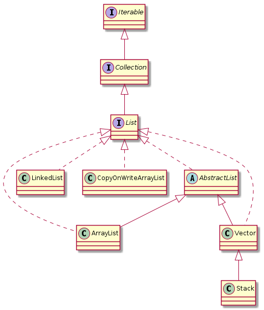

# Java Lists

 Java'da `List` veri yapısı, tıpkı `Map`, `Set` ve `Queue` gibi bir java programının çalışması 
 esnasında kullanılan verileri ihtayaca göre saklamak/store etmek için kullanılır ve `java.util`
 paket'i/package'ı altında bulunur. 
 
 `List` interface'ine ait bazı özellikleri aşağıdaki gibi sıralayabiliriz:
 
 * `java.util.Collection` interface'ini kalıtır/extend eder.

 * `Ordered` yapıya sahiptir dolayısıyla `Eklenme Sırası/Insertion Order` korunur.

 * `Tekrarlanan/duplicate` elemanlara izin verir.

 * Eğer bir `List` implemenatasyonu `null` elemana izin veriyorsa birden fazla `null` eleman da eklenebilir.

 * Elemanlara, integer index'leri(list içerisindeki pozisyonları) ile ulaşılabilir.

 * `List` objesinin kendisini eleman olarak eklemesinde bir sakınca yoktur. Böyle bir işlem niçin yapılmak istensin o da ayrı bir soru işareti tabii.:confused: `Java List'in` geliştiricileri tarafından böyle bir not `javadoc'a` eklendiği için ben de buraya ekliyorum. :smiley:
 
 ### List İmplementasyonları
 
 
 
Diagramda da görüldüğü gibi inceleyeceğimiz `List` implementasyonları aşağıdaki gibi:

* ArrayList 
* LinkedList
* CopyOnWriteArrayList
* Stack
* Vector

 ### Kaynaklar
 
* <https://docs.oracle.com/javase/8/docs/api/java/util/List.html>